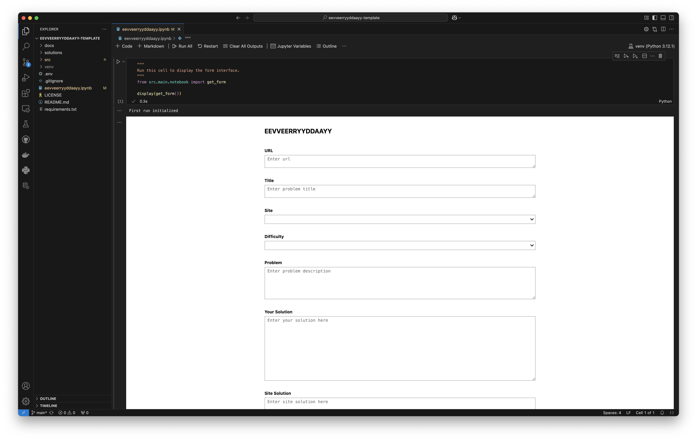
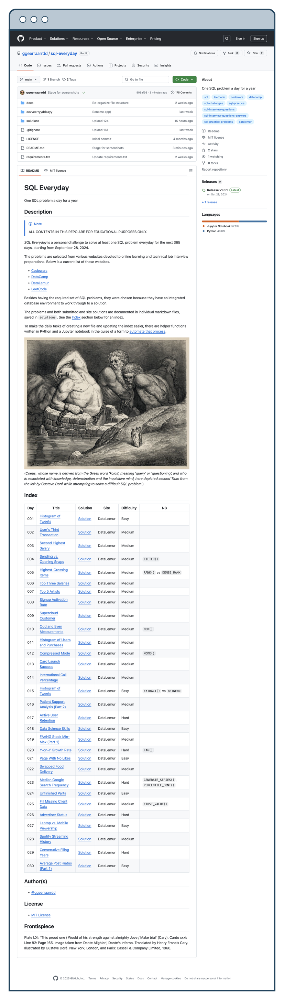

# eevveerryyddaayy

A Github template repository for documenting technical skill-building challenges

## Description

> [!NOTE]
> ALL CONTENTS IN THIS REPO ARE FOR EDUCATIONAL PURPOSES ONLY.
<!-- markdownlint-disable MD028 -->

<!-- markdownlint-enable MD028 -->
> [!NOTE]
> This is the documentation for the Github template repository [`eevveerryyddaayy-template`](https://github.com/ggeerraarrdd/eevveerryyddaayy-template/), which is the templetized version of [`SQL Everyday`](https://github.com/ggeerraarrdd/sql-everyday).

`eevveerryyddaayy-template`, or simply `eevveerryyddaayy`, is a Github template repository that helps you document your self-learning journey. It automates the process of file creation, organizing and storing, as well as indexing your record of personal achievements and development over time. This streamlining allows you to spend more time on what matters most—the actual learning.

Whether you are a student fresh out of college or an experienced developer, this portfolio-building platform simplifies how you track your daily practice, skill-building challenges or technical interview preparation. It keeps all your progress organized in one place.


_(Everyday, it's a gettin' closer / Goin' faster than a roller coaster / Push like yours will surely come my way, a-hey, a-hey-hey / Push like yours will surely come my way)_

## Table of Contents

* [Description](#description)
* [Features](#features)
* [Project Structure](#project-structure)
* [Prerequisites](#prerequisites)
* [Getting Started](#getting-started)
  * [Dependencies](#dependencies)
  * [Installation](#installation)
  * [Configuration](#configuration)
  * [Usage](#usage)
* [Author(s)](#authors)
* [Version History](#version-history)
  * [Release Notes](#release-notes)
  * [Initial Release](#initial-release)
* [Future Work](#future-work)
* [License](#license)
* [Contributing](#contributing)
* [Acknowledgments](#acknowledgments)
* [Screenshots](#screenshots)

## Features

* 🌐 Portfolio Builder - Transforms a Github repository into a coding portfolio website with README.md serving as the homepage
* 📝 Automated File Management - Creates and organizes daily practice files
* 🗂️ Automated Indexing - Creates and maintains a table of contents of your files for quick reference and access
* 📊 Daily Progress Tracking - Visualizes your learning journey in tabular form
* 📚 Solution Repository - Showcases different approaches to programming challenges
* ⚡ Jupyter Notebook Interface - Simplifies data entry through a form-like template

## Project Structure

```text
eevveerryyddaayy-template/
│
├── src/
│   ├── __init__.py
│   │
│   ├── main/
│   │   ├── __init__.py
│   │   │
│   │   ├── config/
│   │   │   └── __init__.py
│   │   │
│   │   ├── helpers/
│   │   │   └── __init__.py
│   │   │
│   │   ├── templates/
│   │   │
│   │   ├── main.py
│   │   └── notebook.py
│   │
│   └── tests/
│       └── __init__.py
│
├── solutions/
│
├── eevveerryyddaayy.ipynb
│
├── docs/
├── .gitignore
├── .pylintrc
├── LICENSE
├── README.md
└── requirements.txt
```

## Prerequisites

* Python 3.12 (not tested on other versions)
* Familiarity with Jupyter Notebooks
* Familiarty with VS Code

## Getting Started

### Dependencies

* See `requirements.txt`

### Installation

1. **Follow Github's documentation on [Creating a repository from a template](https://docs.github.com/en/repositories/creating-and-managing-repositories/creating-a-repository-from-a-template)**

    * The template repository is located [here](https://github.com/ggeerraarrdd/eevveerryyddaayy-template/).

2. **Clone the new repository**

    * Open a terminal widow in VS Code.
    * Navigate to where you want the repository directory saved.

    ```bash
    git clone <your-repository-url>
    ```

3. **Setup a Python virtual environment**

    ```bash
    python3 -m venv venv
    source venv/bin/activate  # On Windows use `venv\Scripts\activate`
    pip install --upgrade pip
    pip install -r requirements.txt
    ```

4. **Install the Jupyter extension**

    ⚠️ **Note:** Template repo tested only on v2024.11.0.

    1. Go to the Extensions Marketplace on VS Code.
    2. Search for "Jupyter" by Microsoft.
    3. Click `Install`

### Configuration

1. **Default settings**

    **Project Title:**
    * The default title is "[ ] Everyday". **You can choose a different title.**

    **Index Table:**
    * The default index table has 5 columns. **You can add a 6th column.**
    * The default name of an activated sixth column is "NB". **You can choose a different name.**
    * The first column uses sequential numbering as default (e.g. "001", "002"). **You can switch to date format.**

    **Form:**
    * The default Site list in the Form includes: [Codewars](https://www.codewars.com/), [DataLemur](https://datalemur.com/) and [LeetCode](https://leetcode.com/). **You can add and remove.**

    If you don't want to change these default settings, skip to #5.
  
2. **Customize Project title**

    ⚠️ **Note:** This changes the project title on README and template file during project initialization. Changing it after initialiation will be a manual process.

    1. Open the `.env` file (with default settings) in the root directory.

        ```python
        # Project: Title
        PROJ_TITLE='[ ] Everyday'
        ```

3. **Customize Index table settings**

     ⚠️ **Note:** These settings cannot be changed after the project has been initialized (see Usage #2).

    1. If not already, open the `.env` file (with default settings) in the root directory.

        ```python
        # Extra Column
        NB=0
        NB_NAME="NB"

        # Sequential Numbering
        SEQ_NOTATION=0
        ```

    2. Add your preferred settings

        * To add a 6th column: `NB=1`
        * To change its default name: `NB_NAME="Your Preferred Name"`
        * To switch to date format: `NB=1`

4. **Customize Form settings**

    ⚠️ **Note:** Unlike the extra column and sequential numbering settings, you can change this setting again after project initiliazation.

    1. If not already, open the `.env` file (with default settings) in the root directory.

        ```python
        # Form Settings
        SITE_OPTIONS=["Codewars", "DataLemur", "LeetCode"]
        ```

    2. Add your preferred settings

        * Edit your preferred sites as a list of strings.
        * If there is only one item in the list, that site becomes the only option and default value. This is for when your project will involve only one site.

5. **Customize README**

    Feel free to make any changes to README, including the title and description of your project.

> [!IMPORTANT]  
> The markdown comments around the Index table must not be modified or deleted.

### Usage

1. Open the project folder on VS Code, if not already.

2. Open `eevveerryyddaayy.ipynb` in the root directory.

3. Execute the cell containing the python code or `Run All` to display the form interface.

    **NOTE:** The project is initialized when this is done for the first time.

4. Fill in the fields and click the submit button.

    Congratualtions! 🎉 You're a day closer to achieving your goal! 🎯

## Author(s)

* [@ggeerraarrdd](https://github.com/ggeerraarrdd/)

## Version History

### Release Notes

* See [https://github.com/ggeerraarrdd/eevvrryyddaayy-template/releases](https://github.com/ggeerraarrdd/eevveerryyddaayy-template/releases)

### Initial Release

* `eevveerryyddaayy` is the templetized version of [`SQL Everyday`](https://github.com/ggeerraarrdd/sql-everyday).

## Future Work

* Filter for the `enhancement` label in [Issues](https://github.com/ggeerraarrdd/eevveerryyddaayy-template/issues).

## License

* [MIT License](https://github.com/ggeerraarrdd/eevveerryyddaayy/blob/main/LICENSE)

## Contributing

* This project is not accepting contributions at this time.

## Acknowledgments

* Coeus

## Screenshots





## Frontispiece

Buddy Holly and The Crickets performing "That'll Be The Day" [Still from broadcast]. The Ed Sullivan Show. CBS, December 1, 1957.
